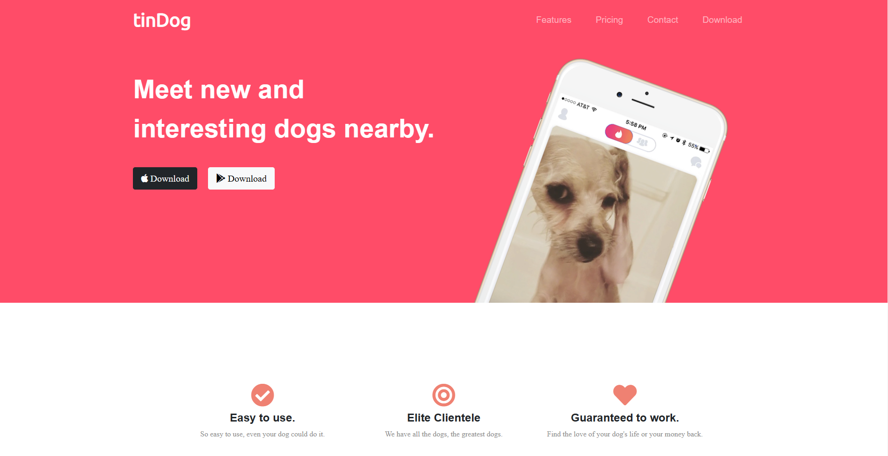
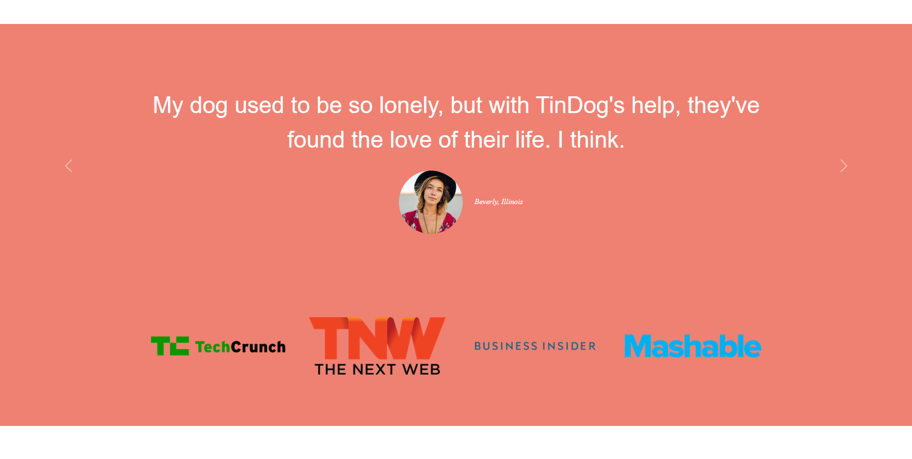
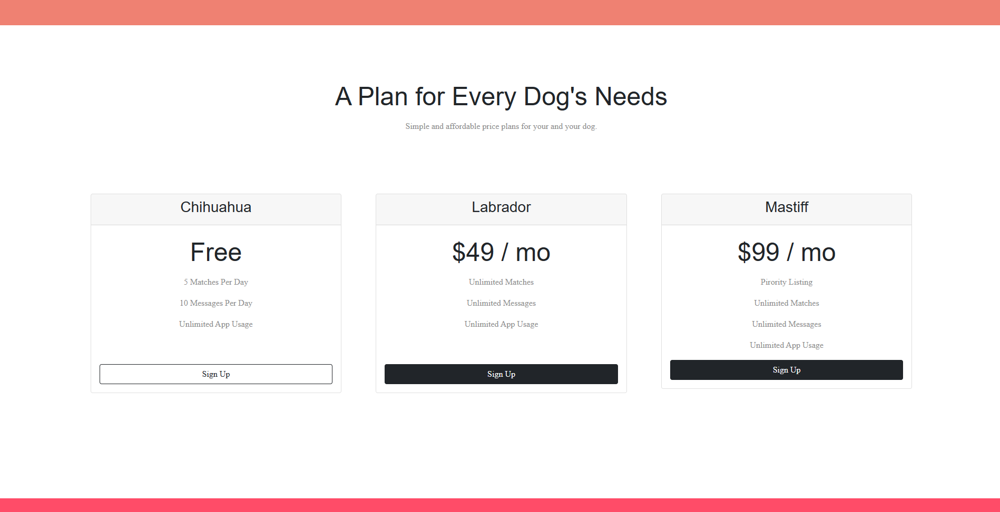
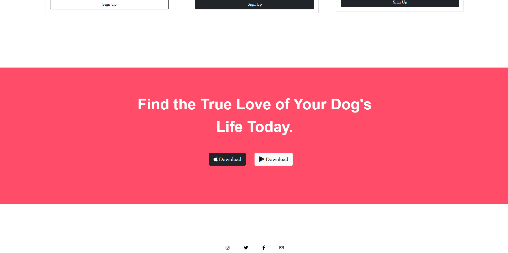

# TinDog
This is my first front-end project which implemented HTML, CSS, and JavaScript. This project also utilized Bootstrap to add some components like the navbar and carousel, Bootstrap also helped to make the web layouting process easier.

## Screenshots

